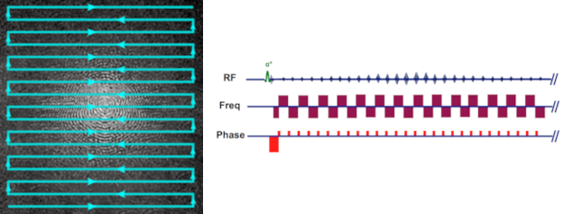
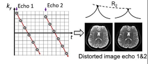
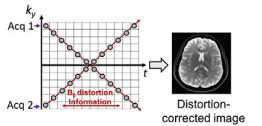
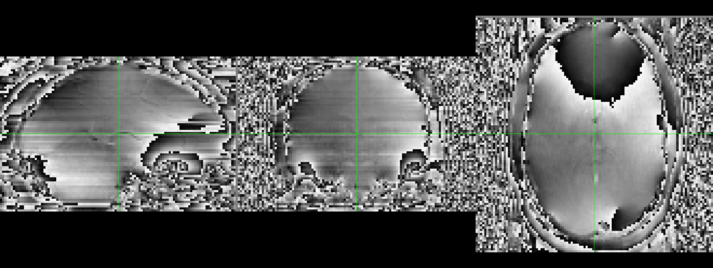
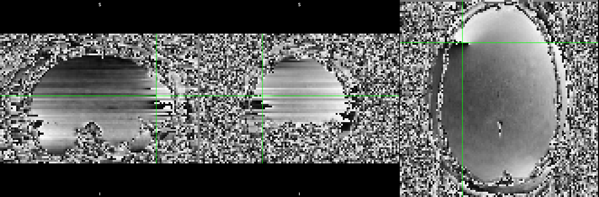
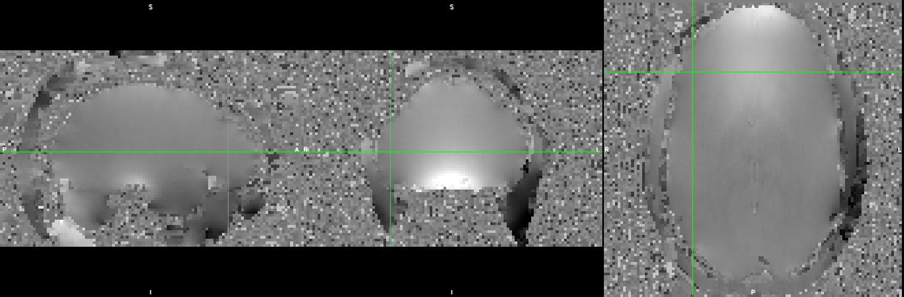

## Overview

- Some MR physics background
- A walkthrough of the framewise **M**ulti-**E**cho **DI**stortion **C**orrection (MEDIC) algorithm
- Results

## Some Background MRI Physics...

## Echo Planar Imaging (EPI)

A single readout train through k-space:

Gradients control readout train.

$$s[k_x, k_y] = \int \int \rho(x,y) e^{-j2\pi(k_x(t)x + k_y(t)y)} dx dy$$

$$k_r(t) = \bar{\gamma} \int^t G_r(t^{\prime}) dt^{\prime}$$

## In the presence of B0 inhomogeneities...

Inhomogeneities add an extra term to the phase:

$$s[k_x, k_y] = \int \int \rho(x,y) e^{-j2\pi(\bar{\gamma} \Delta B_0(x,y) t + k_x(t)x + k_y(t)y)} dx dy$$

The inhomogeneity term is a spatially varying phase roll, which has the following effect on the signal (assuming readout direction x and phase-encoding direction y):

$$\rho(x - \gamma \Delta B_0(x,y) \tau_{dwell}, y - {\gamma} \Delta B_0(x,y) \tau_{readout})$$

where $\tau_{dwell}$ is the time between k-space samples and $\tau_{readout}$ is the time between the first and last echoes of the readout train.
Since $\tau_{dwell}$ is very small, distortion in readout is negligible, but $\tau_{readout}$ is long enough to see significant distortion in phase encoding direction.

## Correcting for distortion caused by B0 inhomogeneities

Correcting distortion requires measuring $\gamma \Delta B_0(x,y)$ (i.e. field map).

Two approaches:

|        Phase Difference       | Reverse Phase Encoding |
| :---------------------------: | :--------------------: |
| |       |

The Multi-Echo Distortion Correction (MEDIC) algorithm uses the phase difference approach.

## MEDIC

## Relationship between echo time, phase and the field map

The difference in phase between two echoes is proportional to the field map:

$$\Delta \phi(x,y) = \gamma \Delta B_0(x,y) (t_{echo2} - t_{echo1})$$

This effectively says that the field map is the slope of the line relating
the echo time to the phase. Then with multiple echoes, $\gamma \Delta B_0(x,y)$ that satisfies the equation:

$$\begin{bmatrix} \phi_1(x,y) \\\\ \phi_2(x,y) \\\\ \vdots \\\\ \phi_n(x,y) \end{bmatrix} = \gamma \Delta B_0(x,y)  \begin{bmatrix} t_{1} \\\\ t_{2} \\\\ \vdots \\\\ t_{n} \end{bmatrix}$$

## In Practice...

## Practical Issue 1: Phase wraps

Raw phase measurements collected off the scanner are wrapped between $-\pi$ and $\pi$:

## Practical Issue 2: Phase offsets

The linear model assumes phase $\phi(x,y) = 0$ if $t = 0$. This is
not true in practice due to imperfections in the receiver coils and coil
combination algorithms. A more realistic model would be:

$$\begin{bmatrix} \phi_1(x,y) \\\\ \phi_2(x,y) \\\\ \vdots \\\\ \phi_n(x,y) \end{bmatrix} = \gamma \Delta B_0(x,y)  \begin{bmatrix} t_{1} \\\\ t_{2} \\\\ \vdots \\\\ t_{n} \end{bmatrix} + \phi_{offset}(x,y)$$

where $\phi_{offset}(x,y)$ is a spatially dependent phase offset.

## Practical Issue 3: Non-uniqueness

$$\begin{bmatrix} \phi_1(x,y) + 2\pi N_1 \\\\ \phi_2(x,y) + 2\pi N_2 \\\\ \vdots \\\\ \phi_n(x,y) + 2\pi N_n \end{bmatrix} = \gamma \Delta B_0(x,y)  \begin{bmatrix} t_{1} \\\\ t_{2} \\\\ \vdots \\\\ t_{n} \end{bmatrix}$$

From the perspective of phase, there is no difference between a phase 
value of $\phi$ and some $2\pi$ multiple offset of it (i.e. $\phi + 2\pi N$). This means that there are an infinite number of solutions to the above equation.

## Assumptions

To solve these issues, we make the following assumptions:

1. The phase is spatially smooth.
2. Phase evolves linearly with time.
3. The global accumulation of phase at echo time 1 is low (more specifically between $[-\pi, \pi]$).
4. Frames with similar head positions have similar unwrapped phase values.

## The MEDIC Algorithm

## Step 1: Correcting phase offsets and unwrapping

Two algorithms:

Multi-Channel Phase Combination using measured 3D phase offsets, Simplified (MCPC-3D-S): For phase offset correction

Rapid Opensource Minimum spanning treE algOrithm (ROMEO): For phase unwrapping

## Phase offset correction using MCPC-3D-S and ROMEO

MCPC-3D-S removes phase offsets through estimating an unwrapped phase
difference between echoes and predicting the phase offset (assuming
linear phase evolution).

> **_NOTE:_** After this step, the only operations applied to the phase data
> is adding or subtracting multiples of $2\pi$.

## Phase unwrapping using ROMEO

ROMEO unwraps phase through a path based unwrapping algorithm. The path
is detemined through several quality metrics, all based around varying
smoothness criterion on the values/gradients of the phase/magnitude images.
ROMEO imposes a linear constraint on the unwrapping solutions of phase
across echoes.

## Step 2: Global mode offset correction

As previously mentioned, unwrapping solutions are non-unique. We can force
uniqueness by assuming that the modal global accumulation of phase at echo time 1, is within the range $-\pi$ and $\pi$. This forces a unique solution.

## Step 3: Temporal Correction

For each TR, compare the phase unwrapping solutions for TRs where the head
is positioned similarly. Then for each voxel, compute any $2\pi$ multiple offsets that would make the phase unwrapping solutions close to the mean.

This seems to have the greatest effect for voxels where SNR is low, and
stabilizes the solutions temporally.

## Results

