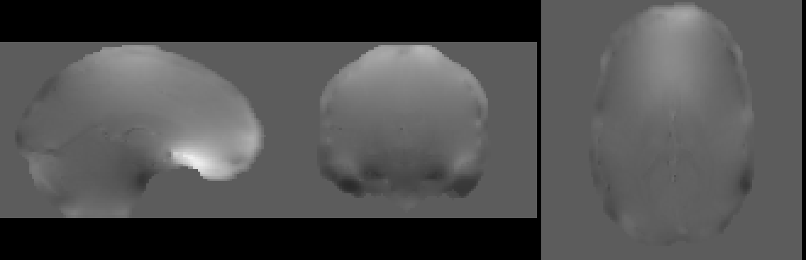

## Today’s Agenda

- An update on PhD requirements progress
  - Papers (Published and In Progress)
  - Refresher on Thesis Aims
- Talk about last aim of Thesis
  - Correction of susceptibility-induced distortion with Multi-Echo Phase Data

## Synth Paper published!

## With 2nd paper in progress...

Also presenting at ISMRM in June.

## Thesis Aims

1. ✅ Apply Synth field map-less EPI distortion correction to diffusion weighted imaging.
2. ✅ Apply Synth field map-less EPI distortion correction in limited data settings.
3. **✅ Leverage multi-echo fMRI data to correct susceptibility distortion.**

## Overview of Multi-Echo DIstortion Correction (MEDIC)

- Background on the physics of Echo Planar Imaging (EPI)
- Overview of **M**ulti-**E**cho **DI**stortion **C**orrection (MEDIC) algorithm
- Discussion of MEDIC vs. PEpolar field map results

## Echo Planar Imaging (EPI) Background

## Echo Planar Imaging (EPI)

A single readout train through k-space:

Gradients control readout train.

$$s[k_x, k_y] = \int \int \rho(x,y) e^{-j(k_x(t)x + k_y(t)y)} dx dy$$

$$k_r(t) = \gamma \int^t G_r(t^{\prime}) dt^{\prime}$$

## In the presence of B0 inhomogeneities...

Inhomogeneities add an extra term to the phase:

$$s[k_x, k_y] = \int \int \rho(x,y) e^{-j(\gamma \Delta B_0(x,y) t + k_x(t)x + k_y(t)y)} dx dy$$

The inhomogeneity term is a spatially varying phase roll, which has the following effect on 
the signal[1] (assuming readout direction x and phase-encoding direction y):

$$\rho(x - (\gamma \Delta B_0(x,y) \tau_{dwell}), y - ({\gamma} \Delta B_0(x,y) \tau_{readout}))$$

where $\tau_{dwell}$ is the time between k-space samples and $\tau_{readout}$ is the time 
between the first and last echoes of the readout train.
Since $\tau_{dwell}$ is very small, distortion in readout is negligible, but
$\tau_{readout}$ is large enough to see significant distortion in phase encoding direction.

[1] Jezzard P, Barnett AS, Pierpaoli C. Characterization of and correction for eddy current artifacts in echo planar diffusion imaging. Magnetic Resonance in Medicine. 1998;39(5):801–812.

## An example

## Correcting for distortion caused by B0 inhomogeneities

Correcting distortion requires measuring $\gamma \Delta B_0(x,y)$ (i.e. field map).

Two approaches[2]:

|         Phase Difference       |        PEpolar         |
| :----------------------------: | :--------------------: |
|  |       |

The **M**ulti-**E**cho **DI**stortion **C**orrection (MEDIC) algorithm uses the phase difference approach.

[2] Wang F, Dong Z, Reese TG, Bilgic B, Katherine Manhard M, Chen J, Polimeni JR, Wald LL, Setsompop K. Echo planar time-resolved imaging (EPTI). Magnetic Resonance in Medicine. 2019;81(6):3599–3615.

## Some Background on MEDIC

## What is MEDIC?

MEDIC is an algorithm that extracts field maps from the phase 
information of multi-echo EPI data. This removes the need for a 
separate field map acquisition:

:::{.element: class="fragment current-visible"}

:::
:::{.element: class="fragment current-visible"}

:::

## Relationship between echo time, phase and the field map

The slope of the relationship between phase and echo time is the field map:

$$\phi(x,y) = \gamma \Delta B_0(x,y) t_{echo}$$

For $n$ echoes, we want to find $\gamma \Delta B_0(x,y)$ that satisfies the equation:

$$\begin{bmatrix} \phi_1(x,y) \\\\ \phi_2(x,y) \\\\ \vdots \\\\ \phi_n(x,y) \end{bmatrix} = \gamma \Delta B_0(x,y)  \begin{bmatrix} t_{1} \\\\ t_{2} \\\\ \vdots \\\\ t_{n} \end{bmatrix}$$

## In Practice...

## Practical Issue 1: Phase wraps

Raw phase measurements collected off the scanner are wrapped between $-\pi$ and $\pi$:

## Practical Issue 2: Phase offsets

The linear model assumes phase $\phi(x,y) = 0$ if $t = 0$. This is
not true in practice due to off-resonance effects in the receiver coils. A more realistic 
model would be:

$$\begin{bmatrix} \phi_1(x,y) \\\\ \phi_2(x,y) \\\\ \vdots \\\\ \phi_n(x,y) \end{bmatrix} = \gamma \Delta B_0(x,y)  \begin{bmatrix} t_{1} \\\\ t_{2} \\\\ \vdots \\\\ t_{n} \end{bmatrix} + \phi_{offset}(x,y)$$

where $\phi_{offset}(x,y)$ is a spatially dependent phase offset.

## Practical Issue 3: Non-uniqueness

$$\begin{bmatrix} \phi_1(x,y) + 2\pi N_1 \\\\ \phi_2(x,y) + 2\pi N_2 \\\\ \vdots \\\\ \phi_n(x,y) + 2\pi N_n \end{bmatrix} = \gamma \Delta B_0(x,y)  \begin{bmatrix} t_{1} \\\\ t_{2} \\\\ \vdots \\\\ t_{n} \end{bmatrix}$$

From the perspective of phase, there is no difference between a phase 
value of $\phi$ and some $2\pi$ multiple offset of it (i.e. $\phi + 2\pi N$). This means that there is no unique solution to the above equation.

## Assumptions

To solve these issues, we make the following assumptions:

1. The phase is spatially smooth.
2. Phase evolves linearly with time.
3. The global accumulation of phase at the 1st echo is low (more specifically between $[-\pi, \pi]$).
4. Frames with similar head positions have similar unwrapped phase values.

## How does MEDIC work?

## Step 1: Correcting phase offsets and unwrapping

Two algorithms:

**M**ulti-**C**hannel **P**hase **C**8ombination using measured **3D** phase offsets, **S**implified (MCPC-3D-S): 
For phase offset correction[3]

**R**apid **O**pensource **M**inimum spanning tre**E** alg**O**rithm (ROMEO): For phase unwrapping[4]

[3] Eckstein K, Dymerska B, Bachrata B, Bogner W, Poljanc K, Trattnig S, Robinson SD. Computationally Efficient Combination of Multi-channel Phase Data From Multi-echo Acquisitions (ASPIRE). Magnetic Resonance in Medicine. 2018;79(6):2996–3006.

[4] Dymerska B, Eckstein K, Bachrata B, Siow B, Trattnig S, Shmueli K, Robinson SD. Phase unwrapping with a rapid opensource minimum spanning tree algorithm (ROMEO). Magnetic Resonance in Medicine. 2021;85(4):2294–2308.

## Step 1a: Phase offset correction using MCPC-3D-S

MCPC-3D-S removes phase offsets through estimating an unwrapped phase
difference between 1st and 2nd echoes and predicting the phase offset (assuming
linear phase evolution).

## Step 1b: Phase unwrapping using ROMEO

ROMEO unwraps phase through a path based unwrapping algorithm (Prim-Jarník algorithm).
The path is detemined through several quality metrics, all based around varying
smoothness criterion on the values/gradients of the phase/magnitude images.
ROMEO imposes a linear constraint on the unwrapping solutions of phase
across echoes.

:::{.element: class="fragment current-visible"}

:::
:::{.element: class="fragment current-visible"}

:::
:::{.element: class="fragment current-visible"}

:::
:::{.element: class="fragment current-visible"}

:::
:::{.element: class="fragment current-visible"}

:::
:::{.element: class="fragment current-visible"}

:::
:::{.element: class="fragment current-visible"}

:::
:::{.element: class="fragment current-visible"}

:::
:::{.element: class="fragment current-visible"}

:::
:::{.element: class="fragment current-visible"}

:::

Phase unwrapping solutions for each echo.

## Step 2: Global mode offset correction (GMOC)

As previously mentioned, unwrapping solutions are non-unique. We can force
uniqueness by assuming that the modal global accumulation of phase at the first echo is 
within the range $-\pi$ and $\pi$, then imposing a linear constraint for all subsequent 
echoes to find the unique solution.

:::{.element: class="fragment current-visible"}

:::
:::{.element: class="fragment current-visible"}

:::
:::{.element: class="fragment current-visible"}

:::

## Step 3: Temporal Correction

GMOC fixes most unwrap errors, but operates globally (all voxels). Local errors are fixed
by Temporal Correction.

For each TR, compare the phase unwrapping solutions for TRs where the head
is positioned similarly (Correlational Similarity of >0.98). Then for each voxel, 
compute any $2\pi$ multiple offsets that would make the phase unwrapping solutions close to the mean.

This step has the greatest effect for voxels where SNR is low.

## Step 4: Computing the field map

The field map is computed by using weighted least squares:

$$ W_{mag} \boldsymbol{\phi} = W_{mag} \gamma \Delta B_0 \mathbf{t} $$

where $W_{mag}$ is the magnitude at each echo.

## Step 5: SVD Filtering

To remove temporal noise components, an SVD filtering step is applied to the field map (voxels x time) and small singular values from the data are removed.

<video width="720" height="480" controls loop>
<source src="videos/svd.mp4" type="video/mp4">
</video>

## Step 6: Inverting the field map

Field maps computed on ME-EPI data are in the distorted space, so we must invert the field 
map to get it into the undistorted space:

$$y_{undistorted} = y_{distorted} - \Delta r(x, y_{distorted})$$

The field map is converted into a displacement field, then the ITK 
library `InvertDisplacementFieldImageFilter` is used to invert the field. The inverted 
displacement field is then converted back into a field map.

:::{.element: class="fragment current-visible"}

:::
:::{.element: class="fragment current-visible"}

:::

## Results

## Acquisition Parameters and Datasets

- CMRR Multi-Echo EPI Sequence
  - TR: 1.761 s, TEs: 14.2, 38.93, 63.66, 88.39, 113.12 ms, 72 Slices, FOV: 110x110, Voxel Size: 2.0 mm, Multi-Band: 6
- Spin Echo PEpolar Field maps
  - TR: 8 s, TE: 66 ms, 72 Slices, FOV: 110x110, Voxel Size: 2.0mm
  - Field map solutions computed with FSL TOPUP
- T1w/T2w Anatomical Scans
  - T1w: Multiecho MPRAGE, TR: 2.5 s, TEs: 1.81, 3.6, 5.39, 7.18 ms, 208 Slices, FOV: 300x300, Voxel Size: 0.8 mm, Bandwidth: 745 Hz/px
  - T2w: T2 SPACE, TR: 3.2, TE: 565 ms, 176 Slices, Turbo Factor: 190, FOV: 256x256, Voxel Size: 1 mm, Bandwidth: 240 Hz/px

- Datasets (Resting State Only)
  - Midnight Scan Club (N=1)
  - ASD/ADHD Dataset (N=21)
  - UPenn preliminary data (N=1)

## MEDIC correction has greater correspondence to cortical anatomy than PEpolar correction

:::{.element: class="fragment current-visible"}

:::
:::{.element: class="fragment current-visible"}

:::
:::{.element: class="fragment current-visible"}

:::
:::{.element: class="fragment current-visible"}

:::
:::{.element: class="fragment current-visible"}

:::
:::{.element: class="fragment current-visible"}

:::

## MEDIC correction produces greater correspondence to anatomy in both global and local alignment metrics.

:::{.element: class="fragment current-visible"}

Global alignment metrics (whole brain) for ASD/ADHD Dataset. ✅ indicates best metric that was
statistically significant (p < 0.05). Correlation metric is the Pearson correlation between the functional and anatomical data. Grad. Corr. is the Pearson correlation between the gradient
of the functional and anatomical data. Norm. MI is the normalized mutual information between the
functional and anatomical data.

|     Metric      |        MEDIC        |     TOPUP     | t-stat | p-value |  df  |
|:---------------:|:-------------------:|:-------------:|:------:|:-------:|:----:|
| T1w Correlation | ✅**0.412 (0.052)** | 0.403 (0.052) | 15.430 | < 0.001 |  182 |
| T2w Correlation |    0.710 (0.025)    | 0.711 (0.030) | -0.991 |  0.323  |  182 |
| T1w Grad. Corr. | ✅**0.432 (0.040)** | 0.417 (0.039) |  8.526 | < 0.001 |  182 |
| T2w Grad. Corr. |    0.667 (0.034)    | 0.664 (0.055) |  1.184 |  0.238  |  182 |
| T1w Norm. MI    | ✅**0.081 (0.006)** | 0.079 (0.006) | 11.146 | < 0.001 |  182 |
| T2w Norm. MI    | ✅**0.099 (0.007)** | 0.098 (0.008) |  4.018 | < 0.001 |  182 |

:::
:::{.element: class="fragment current-visible"}

Local alignment metrics (whole brain) for ASD/ADHD Dataset. ✅ indicates best metric that was
statistically significant (p < 0.05). Spotlight analysis was performed by computing the average
local correlation between the functional and anatomical images across all voxels within a 3 voxel sphere.

|     Metric      |        MEDIC        |     TOPUP     | t-stat | p-value |  df  |
|:---------------:|:-------------------:|:-------------:|:------:|:-------:|:----:|
|  T1w Spotlight  | ✅**0.347 (0.019)** | 0.340 (0.019) |  9.031 | < 0.001 |  182 |
|  T2w Spotlight  | ✅**0.521 (0.035)** | 0.514 (0.044) |  4.329 | < 0.001 |  182 |

:::
:::{.element: class="fragment current-visible"}

Task based metrics for ASD/ADHD Dataset. ✅ indicates best metric that was
statistically significant (p < 0.05). Each metric examined the separability of tissue
types using anatomical segmentation labels applied to functional data. Separability was
measured by thresholding the functional data along the tissue boundary, comparing the
classification against the anatomical segmenation, and computing the AUC of the resulting
ROC curve.

|     Metric      |        MEDIC        |     TOPUP     | t-stat | p-value |  df  |
|:---------------:|:-------------------:|:-------------:|:------:|:-------:|:----:|
| Brain/Exterior  | ✅**0.754 (0.034)** | 0.748 (0.032) | 12.265 | < 0.001 |  182 |
|   Gray/White    | ✅**0.689 (0.034)** | 0.686 (0.037) |  3.461 | < 0.001 |  182 |
| Ventricle/White |    0.837 (0.056)    | 0.835 (0.059) |  1.473 |   0.142 |  182 |

:::

## MEDIC captures additional off-resonance effects not captured by other field map methods.

:::{.element: class="fragment current-visible"}

If the MEDIC field map is able to more accurately measure field inhomogeneities
(due to greater correspondence to anatomy), where does the error in the PEpolar method come from? Two possibilities:

1. PEpolar method fails to accurately measure susceptibility distortion.
2. ME-EPI data contains other off-resonance effects that are not captured by the PEpolar field map.

Compare to 3rd field map.
:::
:::{.element: class="fragment current-visible"}

Comparison of ME-EPI data to GRE PEpolar field map shows additional off-resonance effects in ME-EPI data.

:::
:::{.element: class="fragment current-visible"}

Comparison of ME-EPI data to GRE PEpolar field map shows additional off-resonance effects in ME-EPI data.

:::
:::{.element: class="fragment current-visible"}

Comparison of ME-EPI data to GRE PEpolar field map shows additional off-resonance effects in ME-EPI data.

:::
:::{.element: class="fragment current-visible"}

:::

## MEDIC frame-to-frame correction does not add significant temporal variation compared to static correction.

:::{.element: class="fragment current-visible"}

{ width=70% }
:::
:::{.element: class="fragment current-visible"}

In ASD/ADHD dataset, tSNR was not significantly different between MEDIC and TOPUP corrected data.

|     Metric      |        MEDIC        |     TOPUP       | t-stat | p-value |  df  |
|:---------------:|:-------------------:|:---------------:|:------:|:-------:|:----:|
|      tSNR       |   38.993 (16.130)   | 39.345 (16.166) | -1.747 |  0.082  |  182 |

:::

## MEDIC can measure field changes due to head position.

<video width="720" height="480" controls loop>
<source src="videos/rot-X.mp4" type="video/mp4">
</video>

-X Rotation

<video width="720" height="480" controls loop>
<source src="videos/rot+X.mp4" type="video/mp4">
</video>

+X Rotation

<video width="720" height="480" controls loop>
<source src="videos/rot-Y.mp4" type="video/mp4">
</video>

-Y Rotation

<video width="720" height="480" controls loop>
<source src="videos/rot+Y.mp4" type="video/mp4">
</video>

+Y Rotation

<video width="720" height="480" controls loop>
<source src="videos/rot-Z.mp4" type="video/mp4">
</video>

-Z Rotation

<video width="720" height="480" controls loop>
<source src="videos/rot+Z.mp4" type="video/mp4">
</video>

+Z Rotation

<video width="720" height="480" controls loop>
<source src="videos/trans-Z.mp4" type="video/mp4">
</video>

-Z Translation

## MEDIC corrections account for head motion effects.

:::{.element: class="fragment current-visible"}

:::
:::{.element: class="fragment current-visible"}

:::
:::{.element: class="fragment current-visible"}

:::
:::{.element: class="fragment current-visible"}

:::
:::{.element: class="fragment current-visible"}

:::
:::{.element: class="fragment current-visible"}

:::
:::{.element: class="fragment current-visible"}

:::
:::{.element: class="fragment current-visible"}

:::
:::{.element: class="fragment current-visible"}

:::

## Conclusions

:::{.element: class="fragment current-visible"}
- MEDIC provides superior distortion correction performance over PEpolar (i.e. TOPUP) method.
  - Mainly driven by more accurate accounting of all off-resonance effects distorting the data.

- MEDIC field maps are coupled in space and time to functional data.
  - No need for co-registration of field map to functional data.
  - Removes separate sequence for field map acquisition.
  - Can account for field changes due to head motion.
:::
:::{.element: class="fragment current-visible"}
- Algorithmic Limitations
  - Suffers from same limitation as phase difference field map methods
    - Requires accurate measurement of phase at two echoes, but areas of very high susceptibility
      have significant signal loss at later echo times.
- Study limitations
  - Only tested on a single ME-EPI protocol
- Future work
  - Test on other ME-EPI protocols as more ME-EPI datasets become available.
  - Modified MEDIC for Bipolar ME acquisitions can allow reduction in time between echoes.
  - Using denoising methods (e.g. NORDIC) on phase images may improve SNR and distortion correction in high susceptibility regions.
:::

