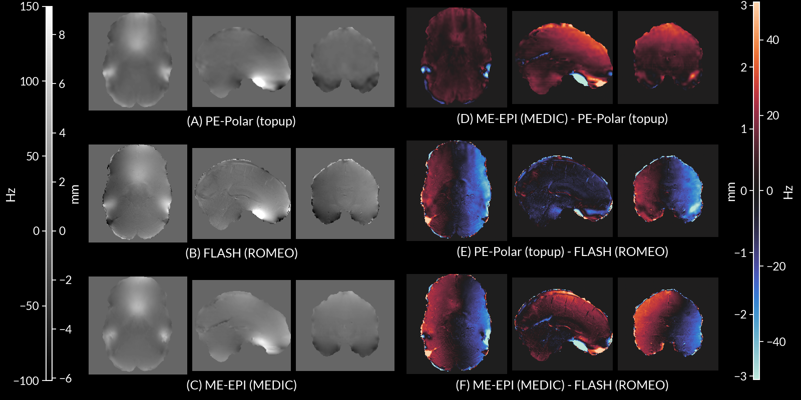
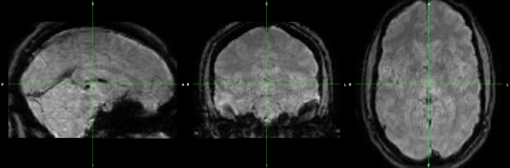
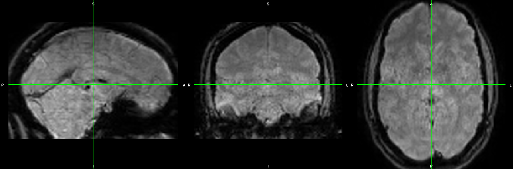
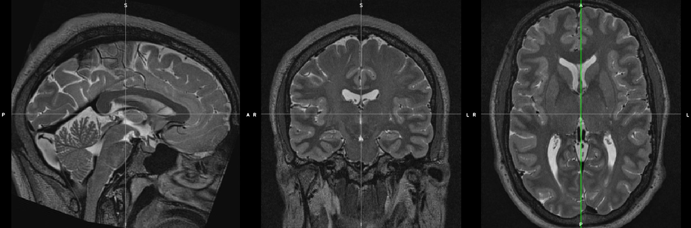
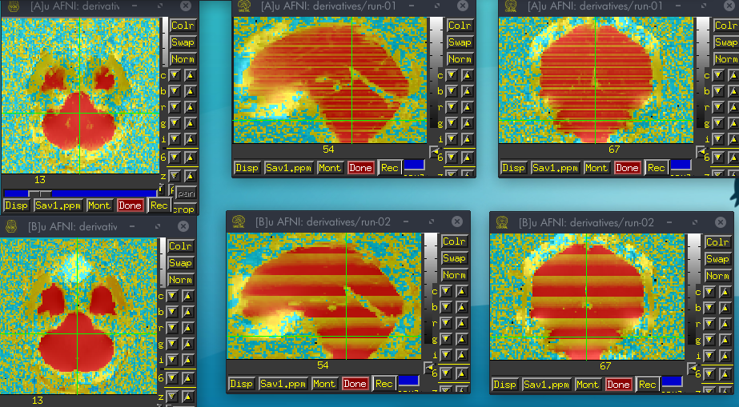

## Overview

- Some MR physics background
- Overview of **M**ulti-**E**cho **DI**stortion **C**orrection (MEDIC) algorithm
- Results

## Some Background MRI Physics...

## Echo Planar Imaging (EPI)

A single readout train through k-space:

Gradients control readout train.

$$s[k_x, k_y] = \int \int \rho(x,y) e^{-j(k_x(t)x + k_y(t)y)} dx dy$$

$$k_r(t) = \gamma \int^t G_r(t^{\prime}) dt^{\prime}$$

## In the presence of B0 inhomogeneities...

Inhomogeneities add an extra term to the phase:

$$s[k_x, k_y] = \int \int \rho(x,y) e^{-j(\gamma \Delta B_0(x,y) t + k_x(t)x + k_y(t)y)} dx dy$$

The inhomogeneity term is a spatially varying phase roll, which has the following effect on 
the signal (assuming readout direction x and phase-encoding direction y):

$$\rho(x - (\gamma \Delta B_0(x,y) \tau_{dwell}), y - ({\gamma} \Delta B_0(x,y) \tau_{readout}))$$

where $\tau_{dwell}$ is the time between k-space samples and $\tau_{readout}$ is the time 
between the first and last echoes of the readout train.
Since $\tau_{dwell}$ is very small, distortion in readout is negligible, but
$\tau_{readout}$ is large enough to see significant distortion in phase encoding direction.

## An example

## Correcting for distortion caused by B0 inhomogeneities

Correcting distortion requires measuring $\gamma \Delta B_0(x,y)$ (i.e. field map).

Two approaches:

|         Phase Difference       | Reverse Phase Encoding |
| :----------------------------: | :--------------------: |
|  |       |

The Multi-Echo DIstortion Correction (MEDIC) algorithm uses the phase difference approach.

## MEDIC

## What is MEDIC?

MEDIC is an algorithm that extracts field maps from the phase 
information of multi-echo EPI data. This removes the need for a 
separate field map acquisition:

:::{.element: class="fragment current-visible"}

:::
:::{.element: class="fragment current-visible"}

:::

## Relationship between echo time, phase and the field map

The slope of the relationship between phase and echo time is the field map:

$$\phi(x,y) = \gamma \Delta B_0(x,y) t_{echo}$$

For $n$ echoes, we want to find $\gamma \Delta B_0(x,y)$ that satisfies the equation:

$$\begin{bmatrix} \phi_1(x,y) \\\\ \phi_2(x,y) \\\\ \vdots \\\\ \phi_n(x,y) \end{bmatrix} = \gamma \Delta B_0(x,y)  \begin{bmatrix} t_{1} \\\\ t_{2} \\\\ \vdots \\\\ t_{n} \end{bmatrix}$$

## In Practice...

## Practical Issue 1: Phase wraps

Raw phase measurements collected off the scanner are wrapped between $-\pi$ and $\pi$:

## Practical Issue 2: Phase offsets

The linear model assumes phase $\phi(x,y) = 0$ if $t = 0$. This is
not true in practice due to off-resonance effects in the receiver coils. A more realistic 
model would be:

$$\begin{bmatrix} \phi_1(x,y) \\\\ \phi_2(x,y) \\\\ \vdots \\\\ \phi_n(x,y) \end{bmatrix} = \gamma \Delta B_0(x,y)  \begin{bmatrix} t_{1} \\\\ t_{2} \\\\ \vdots \\\\ t_{n} \end{bmatrix} + \phi_{offset}(x,y)$$

where $\phi_{offset}(x,y)$ is a spatially dependent phase offset.

## Practical Issue 3: Non-uniqueness

$$\begin{bmatrix} \phi_1(x,y) + 2\pi N_1 \\\\ \phi_2(x,y) + 2\pi N_2 \\\\ \vdots \\\\ \phi_n(x,y) + 2\pi N_n \end{bmatrix} = \gamma \Delta B_0(x,y)  \begin{bmatrix} t_{1} \\\\ t_{2} \\\\ \vdots \\\\ t_{n} \end{bmatrix}$$

From the perspective of phase, there is no difference between a phase 
value of $\phi$ and some $2\pi$ multiple offset of it (i.e. $\phi + 2\pi N$). This means that there is no unique solution to the above equation.

## Assumptions

To solve these issues, we make the following assumptions:

1. The phase is spatially smooth.
2. Phase evolves linearly with time.
3. The global accumulation of phase at the 1st echo is low (more specifically between $[-\pi, \pi]$).
4. Frames with similar head positions have similar unwrapped phase values.

## How does MEDIC work?

## Step 1: Correcting phase offsets and unwrapping

Two algorithms:

Multi-Channel Phase Combination using measured 3D phase offsets, Simplified (MCPC-3D-S): 
For phase offset correction

Rapid Opensource Minimum spanning treE algOrithm (ROMEO): For phase unwrapping

## Step 1a: Phase offset correction using MCPC-3D-S

MCPC-3D-S removes phase offsets through estimating an unwrapped phase
difference between echoes and predicting the phase offset (assuming
linear phase evolution).

> **_NOTE:_** After this step, the only operations applied to the phase data
> is adding or subtracting multiples of $2\pi$.

## Step 1b: Phase unwrapping using ROMEO

ROMEO unwraps phase through a path based unwrapping algorithm. The path
is detemined through several quality metrics, all based around varying
smoothness criterion on the values/gradients of the phase/magnitude images.
ROMEO imposes a linear constraint on the unwrapping solutions of phase
across echoes.

:::{.element: class="fragment current-visible"}

:::
:::{.element: class="fragment current-visible"}

:::
:::{.element: class="fragment current-visible"}

:::
:::{.element: class="fragment current-visible"}

:::
:::{.element: class="fragment current-visible"}

:::
:::{.element: class="fragment current-visible"}

:::
:::{.element: class="fragment current-visible"}

:::
:::{.element: class="fragment current-visible"}

:::
:::{.element: class="fragment current-visible"}

:::
:::{.element: class="fragment current-visible"}

:::

Phase unwrapping solutions for each echo.

## Step 2: Global mode offset correction

As previously mentioned, unwrapping solutions are non-unique. We can force
uniqueness by assuming that the modal global accumulation of phase at the first echo is 
within the range $-\pi$ and $\pi$, then imposing a linear constraint for all subsequent 
echoes to find the unique solution.

:::{.element: class="fragment current-visible"}

:::
:::{.element: class="fragment current-visible"}

:::
:::{.element: class="fragment current-visible"}

:::

## Step 3: Temporal Correction

For each TR, compare the phase unwrapping solutions for TRs where the head
is positioned similarly. Then for each voxel, compute any $2\pi$ multiple offsets that 
would make the phase unwrapping solutions close to the mean.

This seems to have the greatest effect for voxels where SNR is low, and
stabilizes the phase unwrapping solutions temporally.

> **_NOTE:_** Might be revising this step to use correlation as
> a similarity metric instead.

## Step 4: Inverting the field map

Field maps computed on ME-EPI data are in the distorted space, so we must invert the field 
map to get it into the undistorted space:

$$y_{undistorted} = y_{distorted} - \Delta r(x, y_{distorted})$$

The field map is converted into a displacement field, then the ITK 
library`InvertDisplacementFieldImageFilter` is used to invert the field. The inverted 
displacement field is then converted back into a field map.

:::{.element: class="fragment current-visible"}

:::
:::{.element: class="fragment current-visible"}

:::

## Results

## Field Map Comparison

## Correction Comparison

:::{.element: class="fragment current-visible"}

:::
:::{.element: class="fragment current-visible"}

:::
:::{.element: class="fragment current-visible"}

:::
:::{.element: class="fragment current-visible"}

:::

## tSNR Comparison

## MEDIC can measure field changes over time due to head position.

<video width="720" height="480" controls loop>
<source src="videos/rot-X.mp4" type="video/mp4">
</video>

-X Rotation

<video width="720" height="480" controls loop>
<source src="videos/rot+X.mp4" type="video/mp4">
</video>

+X Rotation

<video width="720" height="480" controls loop>
<source src="videos/rot-Y.mp4" type="video/mp4">
</video>

-Y Rotation

<video width="720" height="480" controls loop>
<source src="videos/rot+Y.mp4" type="video/mp4">
</video>

+Y Rotation

<video width="720" height="480" controls loop>
<source src="videos/rot-Z.mp4" type="video/mp4">
</video>

-Z Rotation

<video width="720" height="480" controls loop>
<source src="videos/rot+Z.mp4" type="video/mp4">
</video>

+Z Rotation

<video width="720" height="480" controls loop>
<source src="videos/trans-Z.mp4" type="video/mp4">
</video>

-Z Translation

## Slice Effects

High correlations between slices that are temporally close.

:::{.element: class="fragment current-visible"}

:::
:::{.element: class="fragment current-visible"}

:::

## Is it respiration?

Compute linear model of motion and/or respiration parameters. Compute $R^2$ of fits:

:::{.element: class="fragment current-visible"}

:::
:::{.element: class="fragment current-visible"}

:::
:::{.element: class="fragment current-visible"}

:::

## Is it respiration? (cont.)

After correcting with MEDIC, do a second pass of framewise alignment 
on the data.

## Conclusions

- MEDIC provides comparable quality distortion correction to TOPUP
    - Might suffer in areas of low SNR, in those cases TOPUP might be better (e.g. vmPFC, OFC)
    - However, we add another dimension (time) we can correct over.
- MEDIC probably corrects for respiration effects in the data.
- Once pipeline integration is complete, will get a better idea of how
  MEDIC performs in the context of a full pipeline.
