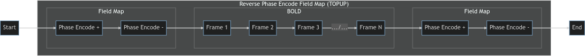
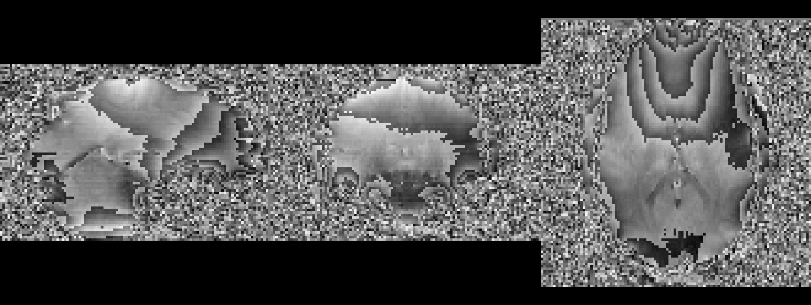

## Echo Planar Imaging suffers from distortion due to B0 inhomogeneities

{ width=80% }

Correcting distortion requires measuring B0 field change.

## Current B0 field mapping approaches

Current approaches[2]:

|         Phase Difference       |        PEpolar         |
| :----------------------------: | :--------------------: |
|  |       |

Both require separate field map acquisitions before/after a EPI scan!

[2] Wang F, Dong Z, Reese TG, Bilgic B, Katherine Manhard M, Chen J, Polimeni JR, Wald LL, Setsompop K. Echo planar time-resolved imaging (EPTI). Magnetic Resonance in Medicine. 2019;81(6):3599–3615.

## The Multi-Echo DIstortion Correction (MEDIC) algorithm

MEDIC is an algorithm that extracts field maps from the phase 
information of multi-echo EPI data. This removes the need for a 
separate field map acquisition:

:::{.element: class="fragment current-visible"}

:::
:::{.element: class="fragment current-visible"}

:::

## How does MEDIC work?

1. Correct phase offsets and phase wraps
2. Global Mode Offset and Temporal Correction
3. Field Map Estimation and SVD Filtering

## How does MEDIC work?

1. Correct phase offsets and phase wraps[3,4]

:::{.element: class="fragment current-visible"}

:::
:::{.element: class="fragment current-visible"}

:::

[3] Eckstein K, Dymerska B, Bachrata B, Bogner W, Poljanc K, Trattnig S, Robinson SD. Computationally Efficient Combination of Multi-channel Phase Data From Multi-echo Acquisitions (ASPIRE). Magnetic Resonance in Medicine. 2018;79(6):2996–3006.

[4] Dymerska B, Eckstein K, Bachrata B, Siow B, Trattnig S, Shmueli K, Robinson SD. Phase unwrapping with a rapid opensource minimum spanning tree algorithm (ROMEO). Magnetic Resonance in Medicine. 2021;85(4):2294–2308.

## How does MEDIC work?

2. Global Mode Offset and Temporal Correction

:::{.element: class="fragment current-visible"}

:::
:::{.element: class="fragment current-visible"}

:::
:::{.element: class="fragment current-visible"}

:::

## How does MEDIC work?

3. Field Map Estimation and SVD Filtering

:::{.element: class="fragment current-visible"}
The field map is computed by using weighted least squares:

$$ W_{mag} \boldsymbol{\phi} = W_{mag} \gamma \Delta B_0 \mathbf{t} $$

where $W_{mag}$ is the magnitude at each echo.
:::

Temporal noise components are removed using SVD filtering:

<video width="720" height="480" controls loop>
<source src="videos/svd.mp4" type="video/mp4">
</video>

## Acquisition Parameters and Datasets

- CMRR Multi-Echo EPI Sequence
  - TR: 1.761 s, TEs: 14.2, 38.93, 63.66, 88.39, 113.12 ms, 72 Slices, FOV: 110x110, Voxel Size: 2.0 mm, Multi-Band: 6
- Spin Echo PEpolar Field maps
  - TR: 8 s, TE: 66 ms, 72 Slices, FOV: 110x110, Voxel Size: 2.0mm
  - Field map solutions computed with FSL TOPUP
- T1w/T2w Anatomical Scans
  - T1w: Multiecho MPRAGE, TR: 2.5 s, TEs: 1.81, 3.6, 5.39, 7.18 ms, 208 Slices, FOV: 300x300, Voxel Size: 0.8 mm, Bandwidth: 745 Hz/px
  - T2w: T2 SPACE, TR: 3.2, TE: 565 ms, 176 Slices, Turbo Factor: 190, FOV: 256x256, Voxel Size: 1 mm, Bandwidth: 240 Hz/px

- Datasets (Resting State Only)
  - Midnight Scan Club (MSC) (N=1)
  - ASD/ADHD Dataset (N=21)
  - UPenn preliminary data (N=1)

## MEDIC can measure field changes due to head position.

<video width="720" height="480" controls loop>
<source src="videos/rot-X.mp4" type="video/mp4">
</video>

-X Rotation

<!-- 

<video width="720" height="480" controls loop>
<source src="videos/rot+X.mp4" type="video/mp4">
</video>

+X Rotation

<video width="720" height="480" controls loop>
<source src="videos/rot-Y.mp4" type="video/mp4">
</video>

-Y Rotation

<video width="720" height="480" controls loop>
<source src="videos/rot+Y.mp4" type="video/mp4">
</video>

+Y Rotation

<video width="720" height="480" controls loop>
<source src="videos/rot-Z.mp4" type="video/mp4">
</video>

-Z Rotation

<video width="720" height="480" controls loop>
<source src="videos/rot+Z.mp4" type="video/mp4">
</video>

+Z Rotation

 -->

## MEDIC correction has greater correspondence to cortical anatomy than PEpolar correction

:::{.element: class="fragment current-visible"}

:::
:::{.element: class="fragment current-visible"}

:::
<!-- :::{.element: class="fragment current-visible"}

:::
:::{.element: class="fragment current-visible"}

:::
:::{.element: class="fragment current-visible"}

:::
:::{.element: class="fragment current-visible"}

::: -->

## MEDIC correction produces greater correspondence to anatomy in both global and local alignment metrics.

:::{.element: class="fragment current-visible"}

Global alignment metrics (whole brain) for ASD/ADHD Dataset. ✅ indicates best metric that was
statistically significant (p < 0.05). Correlation metric is the Pearson correlation between the functional and anatomical data. Grad. Corr. is the Pearson correlation between the gradient
of the functional and anatomical data. Norm. MI is the normalized mutual information between the
functional and anatomical data.

|     Metric      |        MEDIC        |     PEpolar     | t-stat | p-value |  df  |
|:---------------:|:-------------------:|:-------------:|:------:|:-------:|:----:|
| T1w Correlation | ✅**0.412 (0.052)** | 0.403 (0.052) | 15.430 | < 0.001 |  182 |
| T2w Correlation |    0.710 (0.025)    | 0.711 (0.030) | -0.991 |  0.323  |  182 |
| T1w Grad. Corr. | ✅**0.432 (0.040)** | 0.417 (0.039) |  8.526 | < 0.001 |  182 |
| T2w Grad. Corr. |    0.667 (0.034)    | 0.664 (0.055) |  1.184 |  0.238  |  182 |
| T1w Norm. MI    | ✅**0.081 (0.006)** | 0.079 (0.006) | 11.146 | < 0.001 |  182 |
| T2w Norm. MI    | ✅**0.099 (0.007)** | 0.098 (0.008) |  4.018 | < 0.001 |  182 |

:::
:::{.element: class="fragment current-visible"}

Local alignment metrics (whole brain) for ASD/ADHD Dataset. ✅ indicates best metric that was
statistically significant (p < 0.05). Spotlight analysis was performed by computing the average
local correlation between the functional and anatomical images across all voxels within a 3 voxel sphere.

|     Metric      |        MEDIC        |     TOPUP     | t-stat | p-value |  df  |
|:---------------:|:-------------------:|:-------------:|:------:|:-------:|:----:|
|  T1w Spotlight  | ✅**0.347 (0.019)** | 0.340 (0.019) |  9.031 | < 0.001 |  182 |
|  T2w Spotlight  | ✅**0.521 (0.035)** | 0.514 (0.044) |  4.329 | < 0.001 |  182 |

:::
:::{.element: class="fragment current-visible"}

Task based metrics for ASD/ADHD Dataset. ✅ indicates best metric that was
statistically significant (p < 0.05). Each metric examined the separability of tissue
types using anatomical segmentation labels applied to functional data. Separability was
measured by thresholding the functional data along the tissue boundary, comparing the
classification against the anatomical segmenation, and computing the AUC of the resulting
ROC curve.

|     Metric      |        MEDIC        |     TOPUP     | t-stat | p-value |  df  |
|:---------------:|:-------------------:|:-------------:|:------:|:-------:|:----:|
| Brain/Exterior  | ✅**0.754 (0.034)** | 0.748 (0.032) | 12.265 | < 0.001 |  182 |
|   Gray/White    | ✅**0.689 (0.034)** | 0.686 (0.037) |  3.461 | < 0.001 |  182 |
| Ventricle/White |    0.837 (0.056)    | 0.835 (0.059) |  1.473 |   0.142 |  182 |

:::

<!-- ## MEDIC captures additional off-resonance effects not captured by other field map methods.

:::{.element: class="fragment current-visible"}

Comparison of ME-EPI data to GRE PEpolar field map shows additional off-resonance effects in ME-EPI data.

:::
:::{.element: class="fragment current-visible"}

Comparison of ME-EPI data to GRE PEpolar field map shows additional off-resonance effects in ME-EPI data.

:::
:::{.element: class="fragment current-visible"}

Comparison of ME-EPI data to GRE PEpolar field map shows additional off-resonance effects in ME-EPI data.

:::
:::{.element: class="fragment current-visible"}

:::

 -->

## MEDIC frame-to-frame correction does not add significant temporal variation compared to static correction.

:::{.element: class="fragment current-visible"}

{ width=60% }
:::
:::{.element: class="fragment current-visible"}

In ASD/ADHD dataset, tSNR was not significantly different between MEDIC and TOPUP corrected data.

|     Metric      |        MEDIC        |     TOPUP       | t-stat | p-value |  df  |
|:---------------:|:-------------------:|:---------------:|:------:|:-------:|:----:|
|      tSNR       |   38.993 (16.130)   | 39.345 (16.166) | -1.747 |  0.082  |  182 |

:::

## Conclusions

:::{.element: class="fragment current-visible"}
- MEDIC provides superior distortion correction performance over PEpolar (i.e. TOPUP) method
  <!-- - Mainly driven by more accurate accounting of all off-resonance effects distorting the data -->

- MEDIC field maps are coupled in space and time to the same EPI data it is correcting.
  - No need for co-registration of field map to EPI data
  - Removes separate sequence for field map acquisition
  - Can account for field changes due to head motion
:::
:::{.element: class="fragment current-visible"}
- Questions? Come by the poster session!
  - 06/05, 16:00 - 17:00
- Or email me @ vanandrew@wustl.edu
:::

